# Honeypot Web Application Project
This project involves setting up a secure and interactive honeypot environment that mimics a web application with vulnerabilities. Users can attempt three challenges designed to explore SQL Injection (SQLi), Cross-Site Scripting (XSS), and Insecure Direct Object References (IDOR). Logs from user activity are analyzed via custom Kibana dashboards.


## Overview of Environment Setup

This environment includes multiple features and safeguards to create a realistic and secure setup:

1. Configured on a Debian-based VM accessed via Howest’s VPN.
2. Ssh connected to the vm from howest network
3. `sudo apt install curl gnupg2 ca-certificates lsb-release debian-archive-keyring
git`

4. `curl https://nginx.org/keys/nginx_signing.key | gpg --dearmor | sudo tee
/usr/share/keyrings/nginx-archive-keyring.gpg >/dev/null`

5. `gpg --dry-run --quiet --no-keyring --import --import-options import-show
/usr/share/keyrings/nginx-archive-keyring.gpg`

6. `echo "deb [signed-by=/usr/share/keyrings/nginx-archive-keyring.gpg]
http://nginx.org/packages/debian `lsb_release -cs` nginx" | sudo tee
/etc/apt/sources.list.d/nginx.list`
7. `sudo apt update`

8. `sudo apt install nginx`

9. `PATH=/usr/sbin/:$PATH `

10. `sudo apt install php8.2-fpm -y`

11. `sudo usermod -aG www-data nginx`
12. Self-signed SSL certificates for HTTPS connections.
13. `sudo cat /etc/nginx/conf.d/default.conf`
```
server {
    listen 80;
    server_name HoneyPot08;

    return 301 https://$host$request_uri;
}

server {
    listen 443 ssl;
    server_name honeypot08;
    http2 on;
    server_tokens off;

    ssl_certificate /etc/ssl/certs/nginx-selfsigned.crt;
    ssl_certificate_key /etc/ssl/private/nginx-selfsigned.key;

    ssl_protocols TLSv1 TLSv1.1 TLSv1.2 TLSv1.3;
    ssl_ciphers HIGH:!aNULL:!MD5;

    root /usr/share/nginx/HoneyPot08;
    index index.html index.htm index.php;


    location / {
        try_files $uri $uri/ =404;
        # if ($request_method !~ ^(GET|POST)$) {
        #     return 405;
        # }
    add_header X-Frame-Options "DENY";  # XFO
    add_header X-Content-Type-Options "nosniff";  # XCTO
    add_header Strict-Transport-Security "max-age=172800; includeSubDomains" always;  # HSTS

    }

    location ~ \.php$ {
        fastcgi_pass unix:/run/php/php8.2-fpm.sock;
        fastcgi_param SCRIPT_FILENAME $document_root$fastcgi_script_name;
        include fastcgi_params;
    }
}
```
## Environment Components:
14. - Login/Registration system.
    - Admin Dashboard: View and manage user data.
    - Avatar Upload: Supports user profile customization.
    - Challenges: Secure web app vulnerabilities intentionally exposed  for interaction.

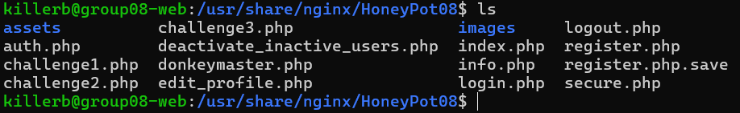

15.  We have enabled users to upload avatars and save them.
16.  We created assets folder with css main.css.

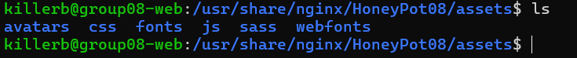

17. Created a database in a separate folder to store user data. (SQLite3)

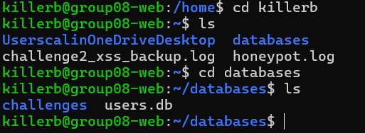

18. Created a lecturer user.
19. Created admin dashboard based on the database. 
20. Created all 3 challenges - SQLi, XSS and IDOR.
## Honeypot listening on a different port:
21. Honeypot set to listen on port 666 with netcat.
22. Honeypot.log monitors users input. 

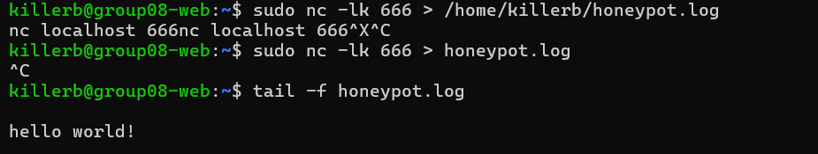

## Extensive Secured Logging Environment:
23. Configured filebeat.
```
output.elasticsearch:
  hosts: ["elk.hp.technet.howest.be:9200"]
  protocol: "https"
  username: "group-08"
  password: "pickingupthepiecesofftheground"
  ssl:
    enabled: true
    ca_trusted_fingerprint: "283B8D5987C5EE09280451F532CCFB2E1AB777ED2955FA5F1B6FD1ADA85AB67E"
    verification_mode: "none"
  index: "group-08-filebeat"
setup.template.name: "group-08-filebeat"
setup.template.pattern: "group-08-filebeat"

```
## THE DASHBOARDS
After adding specific logging logic to each of our challenges, we sent the logs to kibana with filebeat and made some dashboards using the data (fields) we already setup.
 ### General Dashboard
Contains visualisations of endpoints that return the following status codes: 200 / 404 / 500.
#### Endpoints that returned status code 200
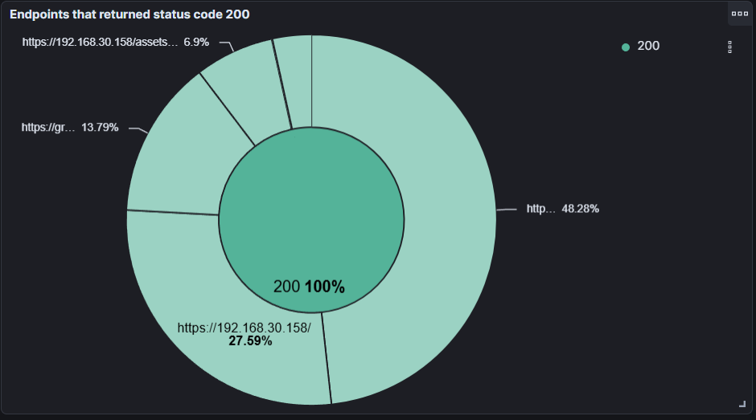
#### Endpoints that returned status code 404
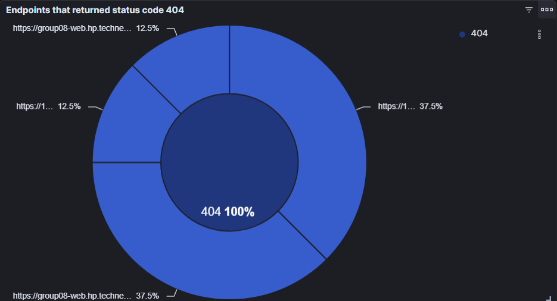
#### Endpoints that returned status code 500
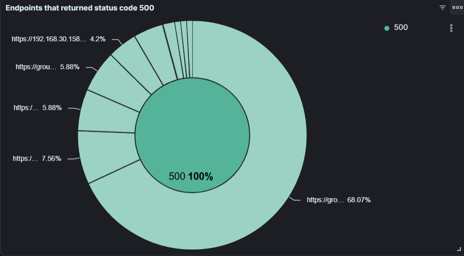
#### Count of requested endpoints per IP address
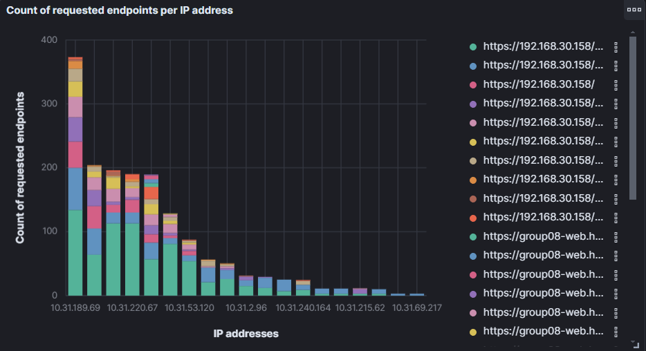
#### Count of error over time & different log levels
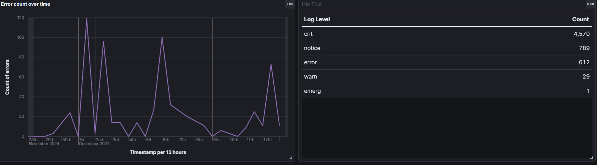

### Challenge 1 Dashboard
#### Attempt Status Breakdown:
Pie chart of status of attempts for challenge 1. /
Line chart of number of attempts over a period of time.
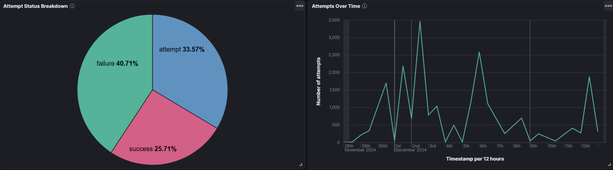
#### Attempts per user:
Vertical bar chart of number of attempts a specific user has done for challenge 1.
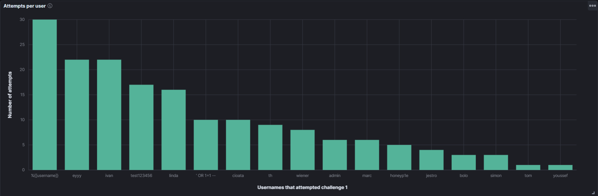
#### Last payload per user:
Table representing the last payload of a given user that attempted the challenge.
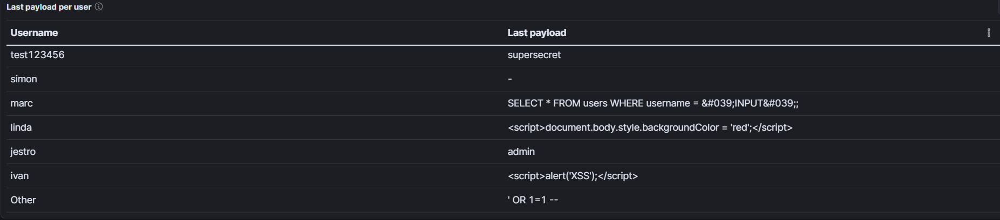
#### Top payloads: 
Horizontal chart of top payloads and how many times they were used.
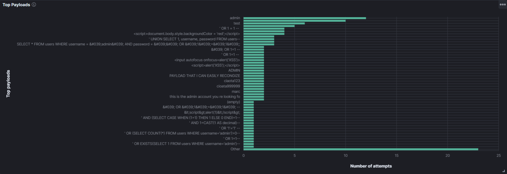


### Challenge 2 Dashboard
#### Attempts and payloads for a given username
Vertical bar visualisation of users and the count of their attempts for challenge 2.
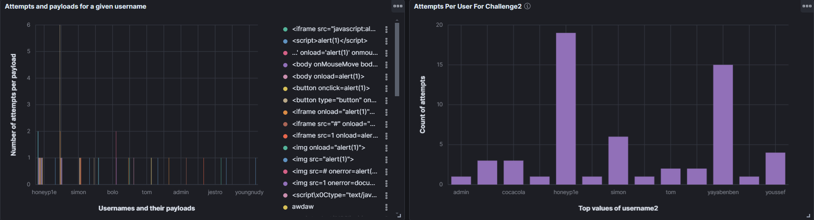
#### Attempts Over Time For Challenge 2
Line chart following the trend of attempts on Challenge 2 over time.
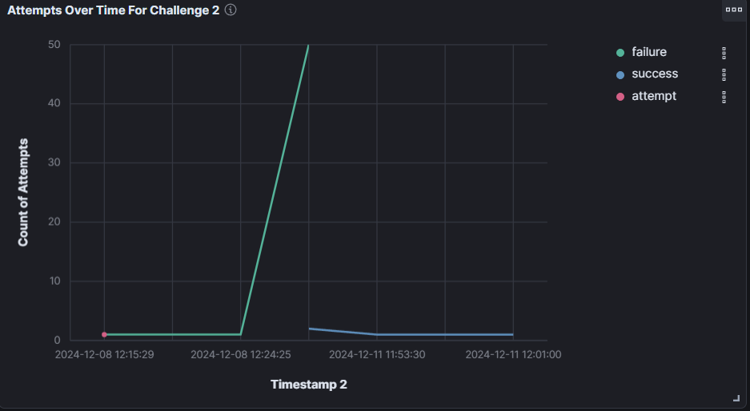
#### Payload Analysis
The table will show a structured list of XSS payload attempts with these details: Username > Payload > Attempt status > Count of payloads.
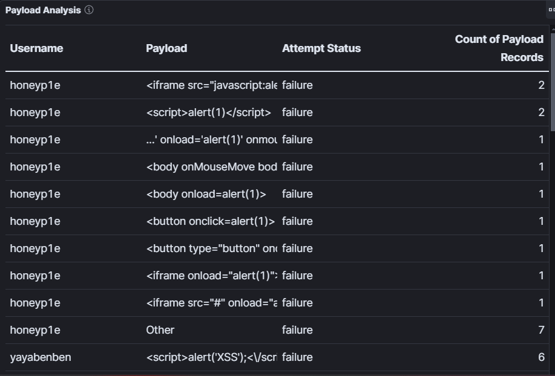
#### Success/Failure Percentage
Pie chart that shows the percentage of successful and failed attempts at solving challenge 2 based on attemp_status2 field.
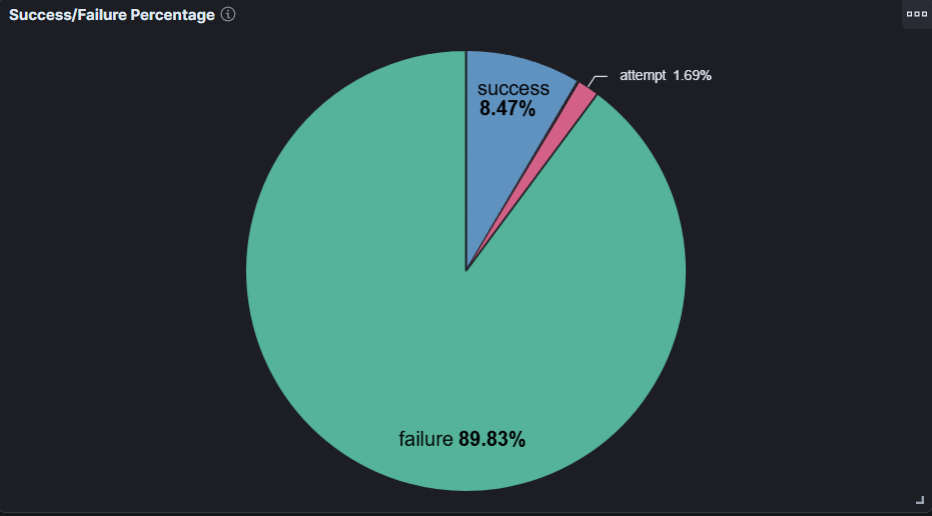


### Challenge 3 Dashboard
#### Profiles accessed per user
Stacked vertical bar chart that gives an overview of all the profiles that user accessed in order to solve the challenge.
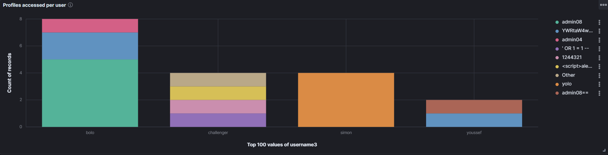
#### Count of successfull attempts per user
Table with usernames and times they have solved challenge 3.
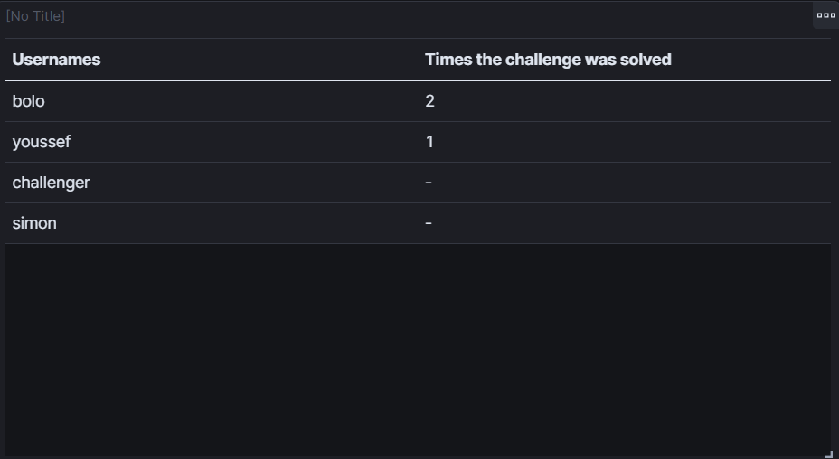
#### Metric visualisations
Displays the count of solved challenge and times the correct profile was accessed.
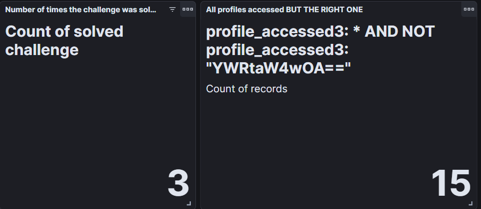

## THE CHALLENGES
21.  ### HONEYPOT CHALLENGE 1 SQLi:
- Description: Exploit a login form or database query to bypass authentication or extract data.
- Solution:
     - `' OR 1 = 1 --` 
     - or alternatively : `"this is the admin account you re looking for"`
22.  ### HONEYPOT CHALLENGE 2 XSS:
- Description: Inject malicious JavaScript to manipulate the client-side behavior of the web app.
- Solution:
     - `<script> alert("hacked") </script>`
23.  ### HONEYPOT CHALLENGE 3 IDOR:
- Description: Access unauthorized user profiles or by modifying request parameters.
- Solution: 
     - `?profile=YWRtaW4wOA==`


#### The Members:
    - Szymon Dudek
    - Yasmine Ben Chouat
    - Calin Mihai Nicolae
#### Mentor:
    - Koen Koerman
     

